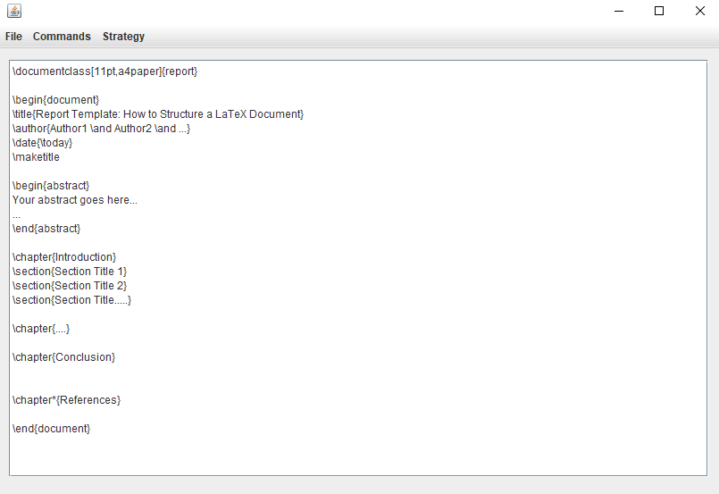

# Legacy App Refactoring

### *University project*
---

## Description

**LaTeX Editor App** is a GUI-based approach to LaTeX editing.

This project focuses on the **refactoring** of its old legacy codebase,
through the use of various techniques and best practises.

## Features

### Ready-to-use templates

### Version control system (both in-memory and on storage).

* In-memory (Volatile)
* On storage (Stable)

https://github.com/alexxarisis/Legacy-App-Refactoring/assets/65713456/5778bc84-14b1-43aa-85c1-77e57dae48ae

### Insertion of **LaTeX** elements:
  * `Chapters`
  * `Sections`
  * `Lists`
  * `Tables`
  * `Images`

### HTML conversion.

https://github.com/alexxarisis/Legacy-App-Refactoring/assets/65713456/b5253efc-f09c-4d3f-8e11-6cf0d7981b86

## Refactoring

To guarantee maintainability and extensibility, the following techniques were used:

* MVC architecture
* Decoupling
* Single Responsibility Principle
* Design patterns
* Clean code
* Best practises
* Testing

## Architecture

### Legacy App

_A mess of dependencies._

### Refactored App

_Clean tree-structured like dependencies, using the MVC architecture._

## How to run

This project uses **Maven** for its dependency control.

*Make sure your system or IDE supports Maven.*

The *Legacy App* and the *Refactored App* are split into two independent modules.

### How to run the Legacy App
1. Traverse to the `LegacyApp/.../view` directory.
2. Run `OpeningWindow`.

### How to run the Refactored App
1. Traverse to the `RefactoredApp/.../org/alexxarisis` directory.
2. Run `Main`.

## Testing

The tests check:
* IO operations
* Conversions
* Version control system
* UI elements
* Frontend to backend data transfers

### How to run tests
1. Traverse to the `RefactoredApp/src/test/java` directory.
2. Run all tests.

## Documentation

The reasons behind each refactoring and their implementation details, 
are entailed in `Report.pdf`.

## Contributors

* [Alexandros Charisis](https://github.com/alexxarisis) 
* [Dimitrios Koliatos](https://github.com/DimitriosKoliat) 
